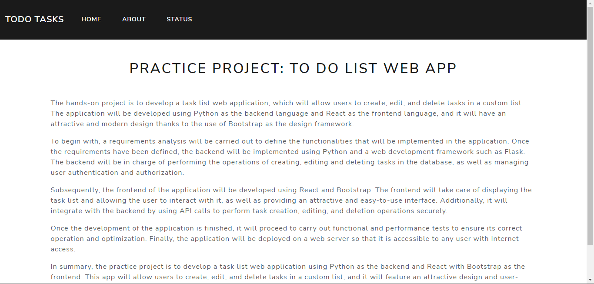
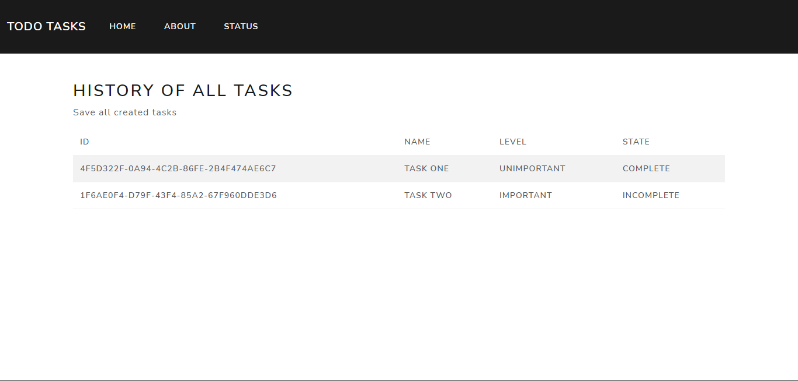
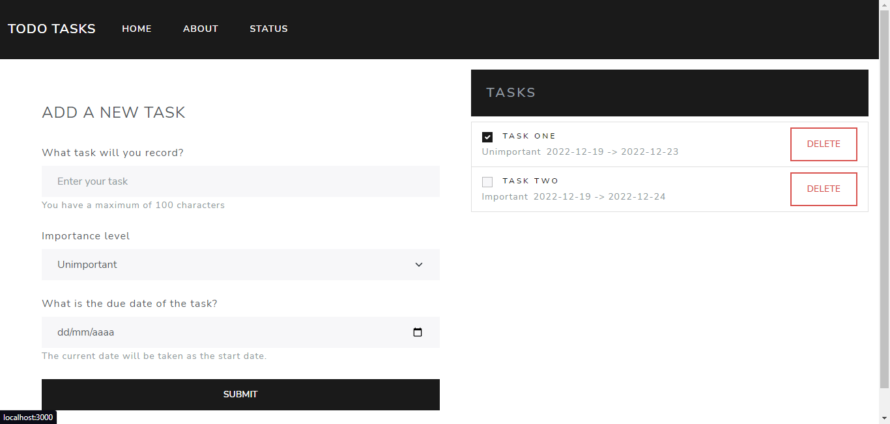

<h1 align='center'>Todo Tasks</h1>

# Description

This project is a web application developed with a React frontend and a Python backend with Flask. This is a task list where you can add tasks, mark as completed, and delete tasks. In addition, MongoDB has been used as a database to store and manage the tasks on the list.

The application has been designed using Bootstrap to provide an attractive and easy-to-use interface.

# REAMDES

:link: [Backend](./backend/README.md)

:link: [Frontend](./frontend/README.md)

# Project Views


---



---



---



# Steps

> ### Note
>
> To be able to run this program it is necessary to have [mongodb](https://www.mongodb.com/), [virtualenv](https://virtualenv.pypa.io/en/latest/) or [docker](https://www.docker.com/) installed.

## Run it with docker

To run docker containers there is a docker-compose.yml file that contains the instructions to run each container on a docker network.

To run docker containers there is a docker-compose.yml file, this contains the instructions to run each container in a docker network, just run the following command in the root path of the project.

```shell
docker-compose up
```

By default the backend will run on port "5050", the frontend on port "3000", and the database on "27018".

> The following explanation is without using docker.

## Manual

### Backend

First we must run mongodb, this can be done in two ways, if you have mongodb on the computer or run the mongo docker container, either of the two is useful and you can find out about them in the official documentation.

> ### Note
>
> Inside the backend project is a settings.py file, it controls some simple project settings including the execution port and the mongodb connection address.

Once all the python modules are installed in the backend project, and inside the virtual environment you can run the backend by running the app.py script.

```shell
python app.py
```

### Frontend

On the frontend side it is easier, just enter the frontend folder, install the necessary modules with the following command.

```shell
npm install
```

And we could now run the web with the start command.

```shell
npm start
```

> ### Note
>
> In src there is a web.config.js file, it contains some configuration variables such as the api address, if necessary they can be modified as well as in an .env file with the REACT_APP_URL_API variable.

# Why?

This project is an opportunity to put into practice and deepen my knowledge in the mentioned technologies. Furthermore, it is a useful and practical application that can be used in daily life to organize and manage tasks efficiently.

# Used technology

- React
- Flask
- MongoDB
- Bootstrap
