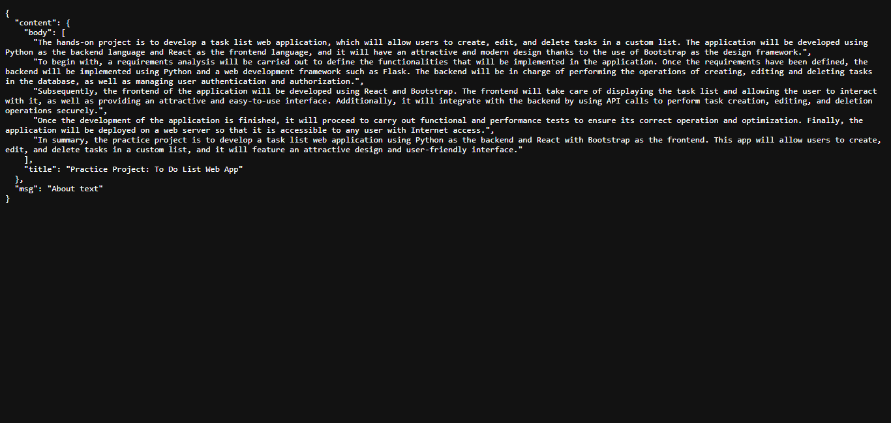
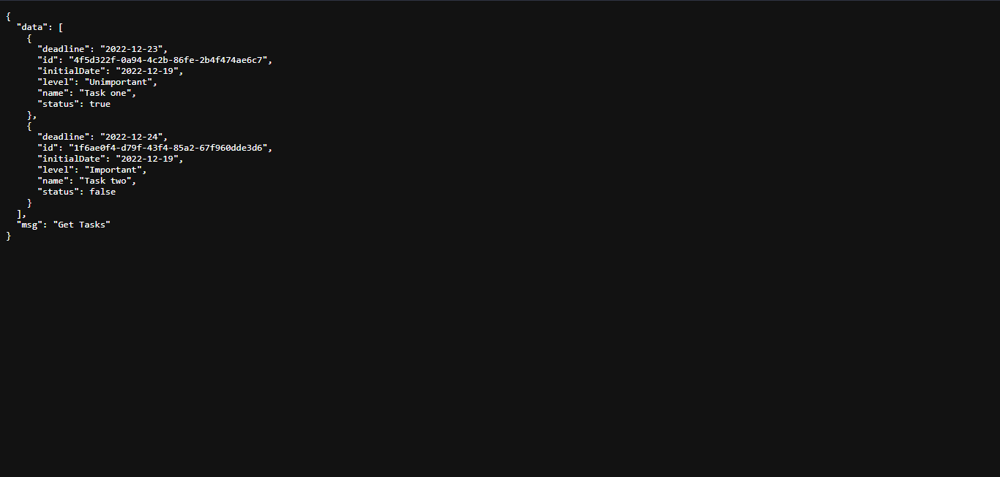

<h1 align='center'>Backend con Python Flask y MongoDB</h1>

This project uses Python Flask and MongoDB for the backend development of the application.

Flask is a Python framework for developing web applications. It has been used to create the server and manage the backend logic, including handling HTTP requests and communicating with the database.

MongoDB is a non-relational database that stores data in documents instead of tables. It has been used to store and manage the tasks in the task list.

This backend is responsible for providing the necessary functionality for the application, including adding, deleting, and marking tasks as complete.

---

# Tecnologías utilizadas

- Python
- Flask
- MongoDB
