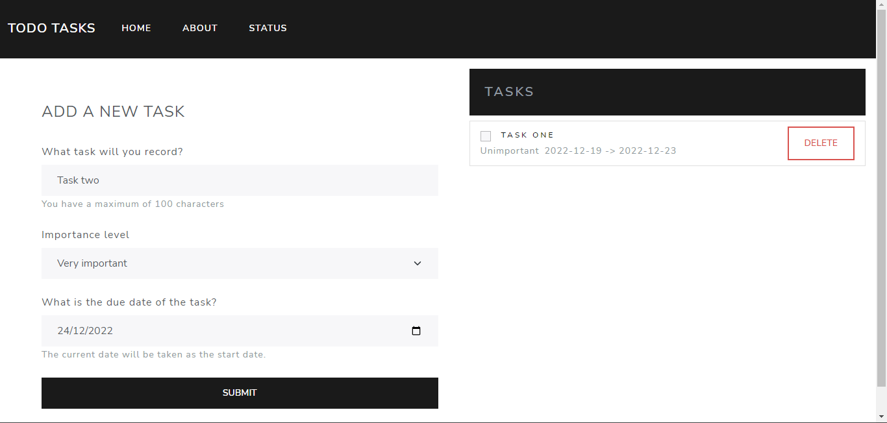

<h1 align='center' >Frontend with React and Bootstrap</h1>

This project uses React and Bootstrap for the development of the frontend of the application.

React is a JavaScript library for creating user interfaces. It has been used to create the application interface and manage user logic.

Bootstrap is an open source design framework for developing web applications. It has been used to create an attractive and easy-to-use interface, using predefined components and responsive styles.

# Used technology

- React
- Bootstrap
